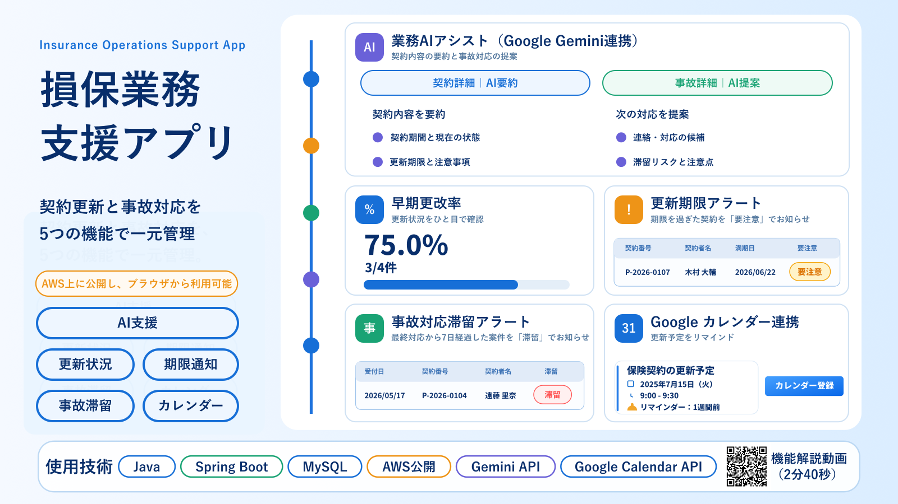
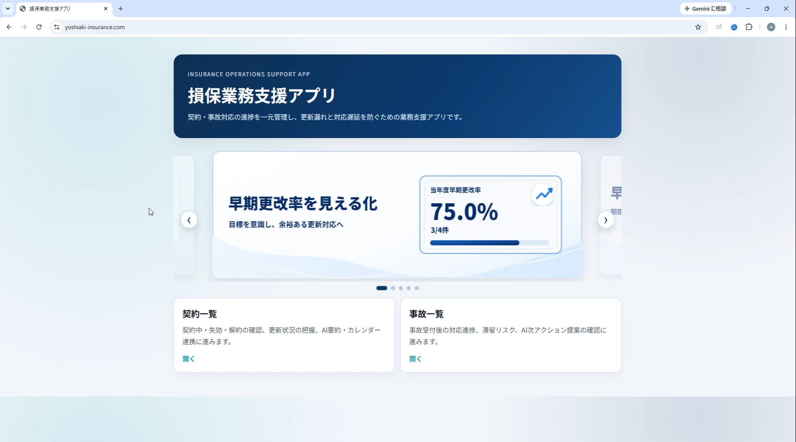
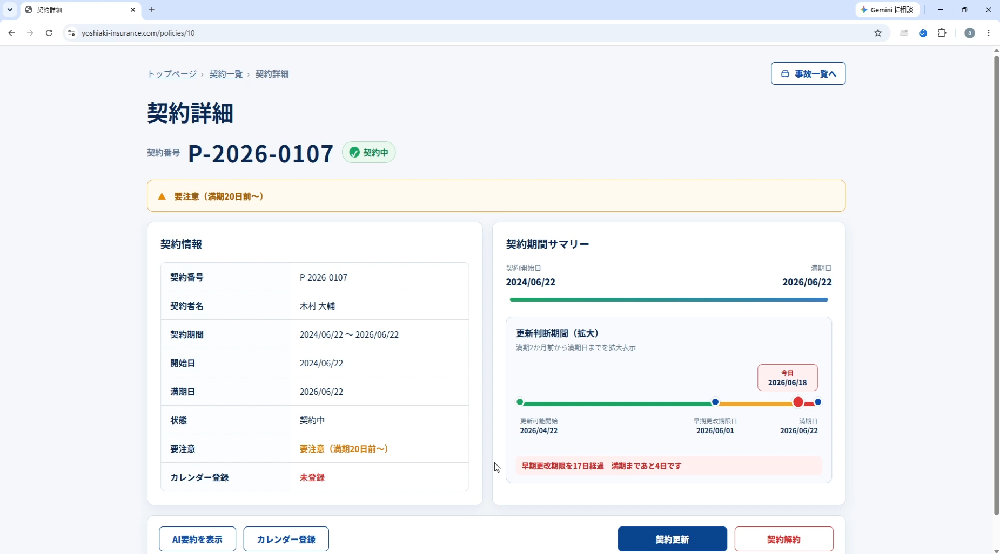
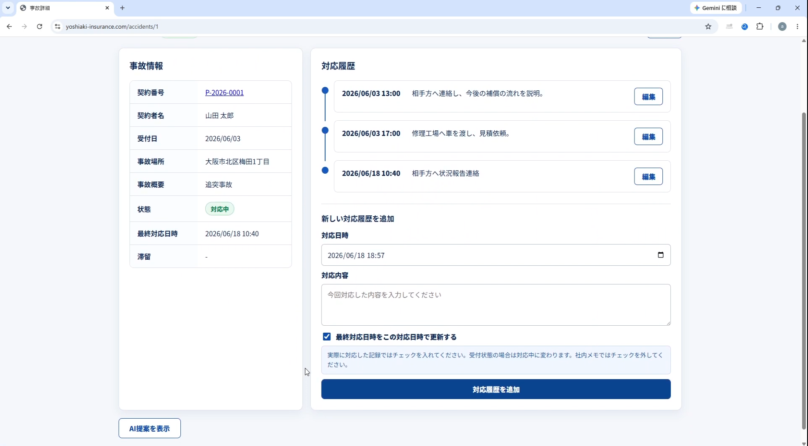

# 損保業務支援アプリ - Spring Boot版

自動車保険の契約管理と事故対応を支援するWebアプリケーションです。  
**契約更新の見落とし、事故対応の滞留、確認作業の負担を減らす**ことを目的に、契約管理・事故対応・AI支援・Googleカレンダー連携を一体化しています。  
Docker Compose構成でSpring BootアプリとMySQLを動かし、AWS上に公開してブラウザから操作できる状態まで構築しています。



📄 **1枚で分かる概要画像**  
👉 [PNGを開く](./doc/overview/insurance-app-overview.png)

🎬 **デモ動画（Google Drive）**  
👉 [機能解説デモ動画を見る (2分40秒)](https://drive.google.com/file/d/1Nwgt1wLsowFGeyCPCYbUBShwHX8QqPLc/view?usp=sharing)  
👉 [基本操作デモ動画を見る (2分)](https://drive.google.com/file/d/1JMccNK1aQLPiDcGwTPKM_cMLpmEjCy0B/view?usp=sharing)

---

## README 1行要約

**保険代理店の実務課題を題材に、契約更新漏れと事故対応遅延を防ぐための Spring Boot 製業務支援Webアプリ。**

---

## 📋 目次

- [概要](#-概要)
- [主な機能](#-主な機能)
- [スクリーンショット](#-スクリーンショット)
- [技術スタック](#-技術スタック)
- [プロジェクト構成](#-プロジェクト構成)
- [セットアップ手順](#-セットアップ手順)
- [基本的な使い方](#-基本的な使い方)
- [コンテナの操作](#-コンテナの操作)
- [DB初期化とデモデータ](#-db初期化とデモデータ)
- [環境変数](#-環境変数)
- [画面一覧](#-画面一覧)
- [設計方針](#-設計方針)
- [ドキュメント](#-ドキュメント)
- [このアプリを作った背景](#-このアプリを作った背景)
- [ライセンス](#-ライセンス)

---

## 📖 概要

このアプリは、損害保険代理店で発生する契約更新管理と事故対応管理を題材にしたポートフォリオ用Webアプリです。  
契約の満期管理、早期更改率の確認、事故対応履歴の記録、滞留事故の検知、AIによる要約・次アクション提案、Googleカレンダーへの更新予定・リマインダー登録を行えます。

### 特徴

- ✅ 契約管理と事故対応を1つのアプリで管理
- ✅ 契約一覧で更新可能契約・要注意契約・早期更改率を確認
- ✅ 事故一覧で受付/対応中・完了・滞留事故を確認
- ✅ 契約詳細でGemini APIによるAI要約を表示
- ✅ 事故詳細でGemini APIによる次の対応案を表示
- ✅ Google Calendar APIと連携し、契約更新予定をカレンダーへ登録
- ✅ Docker Compose構成でローカル起動でき、AWS上にも公開

### 想定ユーザー

- 保険代理店で契約更新や満期管理を担当するスタッフ
- 事故受付後の対応履歴や進捗を管理する担当者
- 更新漏れ・対応漏れを早めに把握したい管理者

### ポートフォリオとして見てほしい点

- Spring Bootでの画面・業務ロジック・DB操作の実装
- 契約管理と事故対応を題材にした業務アプリ設計
- Gemini API / Google Calendar APIとの外部連携
- Docker Composeを使った実行環境の構成
- AWS上に公開し、ブラウザから操作できる状態まで構築した点

---

## ✨ 主な機能

### 契約管理

- 契約一覧の表示（更新可能 / 契約中 / 解約 / 失効 / 全件）
- 契約番号・契約者名による検索
- 契約の新規登録（契約番号は年度ごとに自動採番、満期日は開始日から1年後を自動計算）
- 契約の更新 / 更新取消（当日限定）
- 契約の解約 / 解約取消（当日限定）
- 要注意バッジ（満期20日前〜満期日の契約に表示）
- 早期更改率の表示（当年度 / 当月）
- 契約詳細から事故一覧への導線

### 事故対応管理

- 事故一覧の表示（受付/対応中 / 完了 / 全件）
- 事故の新規登録（契約を検索・選択して紐付け）
- 事故詳細で事故情報と対応履歴を確認
- 対応履歴の追加・編集
- 対応履歴登録時に最終対応日時を更新するか選択可能
- ステータス管理（受付 → 対応中 → 完了）
- 滞留バッジ（7日以上対応がない未完了事故を表示）
- 事故詳細から契約一覧への導線

### AI支援

- 契約詳細で、契約期間・注意事項・重要ポイントをAI要約
- 事故詳細で、事故内容や対応履歴をもとに次の対応案をAI提案
- 完了済み事故ではAI提案を利用できないよう制御
- 1日あたりのAI利用回数を環境変数で制限可能
- Gemini APIを利用し、APIキー未設定時やテスト時はスタブ実装へ切り替え可能

### Googleカレンダー連携

- Google OAuth 2.0でログイン
- 契約詳細から契約更新予定をGoogleカレンダーへ登録
- 満期7日前の通知を想定した予定登録
- カレンダー登録済み/未登録を契約詳細で確認

### AWS公開・デモ運用

- Docker / Docker ComposeでアプリとMySQLを構成
- AWS上に公開し、ブラウザから操作できる状態まで構築
- デモ撮影前に同じ状態へ戻せる `reset-demo.sql` を用意

---

## 📸 スクリーンショット

### トップページ

AWS上に公開したアプリの入口画面です。契約一覧・事故一覧への導線と、主要機能を紹介するバナーを配置しています。



### 契約詳細

契約情報、更新判断期間、要注意表示、AI要約、Googleカレンダー登録を1画面で確認できます。



### 事故詳細

事故情報と対応履歴を左右に分けて表示し、対応内容の追加・編集、最終対応日時の更新、AI提案を行えます。



---

## 🧰 技術スタック

| 区分 | 使用技術 |
|------|----------|
| 言語 | Java 21 |
| フレームワーク | Spring Boot 4.0.2 |
| Web | Spring MVC / Thymeleaf |
| DB操作 | Spring Data JPA |
| データベース | MySQL 8 / H2（開発・テスト補助） |
| マイグレーション | Flyway |
| 外部API | Gemini API / Google Calendar API |
| 認証連携 | Spring Security / Google OAuth 2.0 |
| ビルド | Maven |
| 実行環境 | Docker / Docker Compose |
| 公開環境 | AWS |

---

## 📁 プロジェクト構成

```text
src/main/java/jp/yoshiaki/insuranceapp/
├── client/          # Gemini API・Google Calendar APIなどを呼び出す処理
├── config/          # Spring Security、AI、Googleカレンダー設定
├── controller/      # 画面移動・リクエスト処理
├── dto/             # 画面表示・入力用DTO
├── entity/          # DBに保存するデータの形
├── exception/       # 例外処理
├── repository/      # Spring Data JPAリポジトリ
└── service/         # 業務ロジック

src/main/resources/
├── db/migration/    # Flywayマイグレーション
├── static/          # CSS / JavaScript / 画像
├── templates/       # Thymeleafテンプレート
├── data.sql         # 最小初期データ
└── reset-demo.sql   # デモ用データリセットSQL

doc/
├── demo/            # デモ動画リンク
├── deploy/          # AWS公開手順
├── design/          # 設計資料
├── overview/        # 概要画像
└── user_guide/      # ユーザーズガイド
```

---

## 🚀 セットアップ手順

### 前提条件

- Docker Desktop（または Docker Engine + Docker Compose）
- 外部API連携を試す場合は、Gemini APIキーとGoogle OAuthクライアント情報

### 1. 環境変数ファイルの準備

プロジェクトルートで `.env` を作成します。

```bash
cp .env.example .env
```

PowerShellの場合:

```powershell
Copy-Item .env.example .env
```

`.env` のDBパスワード、Gemini APIキー、Google OAuthクライアント情報を必要に応じて設定してください。

### 2. コンテナの起動

```bash
docker compose up -d --build
```

### 3. アクセス確認

ブラウザで以下にアクセスします。

```text
http://localhost:8080/
```

---

## 📖 基本的な使い方

### 契約管理の流れ

1. トップページから「契約一覧」を開く
2. 更新可能契約や要注意契約を確認する
3. 契約詳細で契約更新・解約・AI要約・カレンダー登録を行う
4. 必要に応じて、契約詳細から事故一覧へ移動する

### 事故対応の流れ

1. トップページから「事故一覧」を開く
2. 受付/対応中・完了・滞留状況を確認する
3. 事故詳細で対応履歴を追加・編集する
4. 必要に応じてAI提案を確認し、次の対応判断に活用する

---

## 🐳 コンテナの操作

| 操作 | コマンド |
|------|----------|
| 起動 | `docker compose up -d --build` |
| 停止 | `docker compose down` |
| データを含めて削除 | `docker compose down -v` |
| アプリログ確認 | `docker compose logs -f app` |
| DBログ確認 | `docker compose logs -f mysql` |

---

## 📁 DB初期化とデモデータ

通常起動時は `data.sql` の最小データを利用します。  
デモ動画撮影や操作確認で同じ状態に戻したい場合は、`reset-demo.sql` を実行します。

### デモ前リセット例

```bash
docker compose exec -T mysql sh -lc 'mysql -u root -p"$MYSQL_ROOT_PASSWORD" -D insuranceapp' < src/main/resources/reset-demo.sql
```

### 件数確認例

```bash
docker compose exec mysql sh -lc 'mysql -u root -p"$MYSQL_ROOT_PASSWORD" -D insuranceapp -e "SELECT COUNT(*) AS policy_count FROM policies; SELECT COUNT(*) AS accident_count FROM accidents;"'
```

---

## 🔧 環境変数

主な環境変数は `.env.example` にまとめています。秘密情報は `.env` に設定し、Git管理しない想定です。

| 変数名 | 用途 |
|--------|------|
| `MYSQL_ROOT_PASSWORD` | MySQL rootパスワード |
| `MYSQL_DATABASE` | MySQLデータベース名 |
| `MYSQL_USER` / `MYSQL_PASSWORD` | アプリ用DBユーザー |
| `DB_URL` | Spring Bootから接続するDB URL |
| `DB_USERNAME` / `DB_PASSWORD` | Spring Boot用DB認証情報 |
| `GOOGLE_CLIENT_ID` / `GOOGLE_CLIENT_SECRET` | Google OAuth / Calendar API連携 |
| `GEMINI_API_KEY` | Gemini APIキー |
| `GEMINI_API_MODEL` | 利用するGeminiモデル |
| `AI_DAILY_USAGE_LIMIT` | AI機能の1日あたり利用上限 |

---

## 📸 画面一覧

| 画面 | URL | 説明 |
|------|-----|------|
| トップ | `/` | アプリ概要、バナー、契約一覧・事故一覧への導線 |
| 契約一覧 | `/policies` | タブ切り替え、検索、早期更改率、要注意契約の確認 |
| 契約新規登録 | `/policies/new` | 契約者名と開始日を入力して契約登録 |
| 契約詳細 | `/policies/{id}` | 契約情報、契約更新、解約、AI要約、カレンダー登録 |
| 事故一覧 | `/accidents` | 受付/対応中、完了、全件、滞留事故の確認 |
| 事故新規登録 | `/accidents/new` | 契約を検索・選択して事故登録 |
| 事故詳細 | `/accidents/{id}` | 事故情報、対応履歴、ステータス更新、AI提案 |

---

## 📖 設計方針

### アーキテクチャ

Spring BootのMVC構成をベースに、画面処理・業務ロジック・データアクセス・外部API連携の役割を分けています。

- **Controller**: リクエスト受付、入力チェック、画面移動
- **Service**: 契約更新、事故対応、AI利用制限などの業務ルール
- **Repository**: Spring Data JPAによるDB操作
- **Entity**: 契約・事故・対応履歴など、DBに保存するデータの形
- **Client**: Gemini API、Google Calendar APIなど外部APIを呼び出す処理
- **DTO**: 画面表示・入力用のデータ受け渡し

### 業務ルールの例

- 更新可能期間は満期2か月前〜満期日
- 要注意期間は満期20日前〜満期日
- 早期更改率を当年度・当月で集計
- 事故は7日以上対応がない場合に滞留扱い
- 完了済み事故ではAI提案を利用不可
- AI機能は1日あたりの利用上限を設定可能

### 外部連携

- AI要約・AI提案はGemini APIを利用
- 契約更新予定のカレンダー登録はGoogle Calendar APIを利用
- Google Calendar API利用時はGoogle OAuth 2.0で認証
- 外部APIを呼び出す処理は専用クラスに分け、テスト用の仮実装（スタブ）にも切り替え可能

---

## 📚 ドキュメント

- [📄 1枚で分かる概要画像（PNG）](./doc/overview/insurance-app-overview.png)
- [📘 ユーザーズガイド（PDF）](./doc/user_guide/user_guide_springboot_v1.pdf)
- [🎬 機能解説デモ動画（Google Drive）](https://drive.google.com/file/d/1Nwgt1wLsowFGeyCPCYbUBShwHX8QqPLc/view?usp=sharing)
- [🎬 基本操作デモ動画（Google Drive）](https://drive.google.com/file/d/1JMccNK1aQLPiDcGwTPKM_cMLpmEjCy0B/view?usp=sharing)
- [☁️ AWS公開手順](./doc/deploy/AWS_DEPLOY_GUIDE.pdf)

---

## 💡 このアプリを作った背景

損害保険代理店での実務経験をもとに、日常業務で特に重要だった「契約更新の管理」と「事故対応の進捗管理」をWebアプリとして実装しました。  
契約の満期が近づいたときの更新漏れ、事故受付後の対応滞留、担当者が次に何を確認すべきか分かりづらい状況を減らすため、一覧・詳細・アラート・AI支援・カレンダー連携を組み合わせています。

Servlet/JSP版で作成した業務支援アプリをベースに、Spring Boot版ではAWS公開、Gemini API、Google Calendar API、Docker構成などを加え、より実運用に近い構成へ発展させています。

---

## 📄 ライセンス

ポートフォリオ用の個人プロジェクトです。
